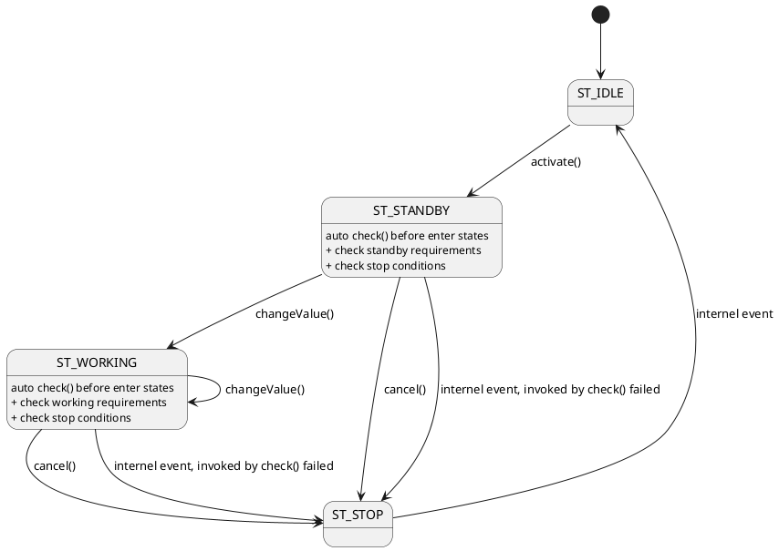
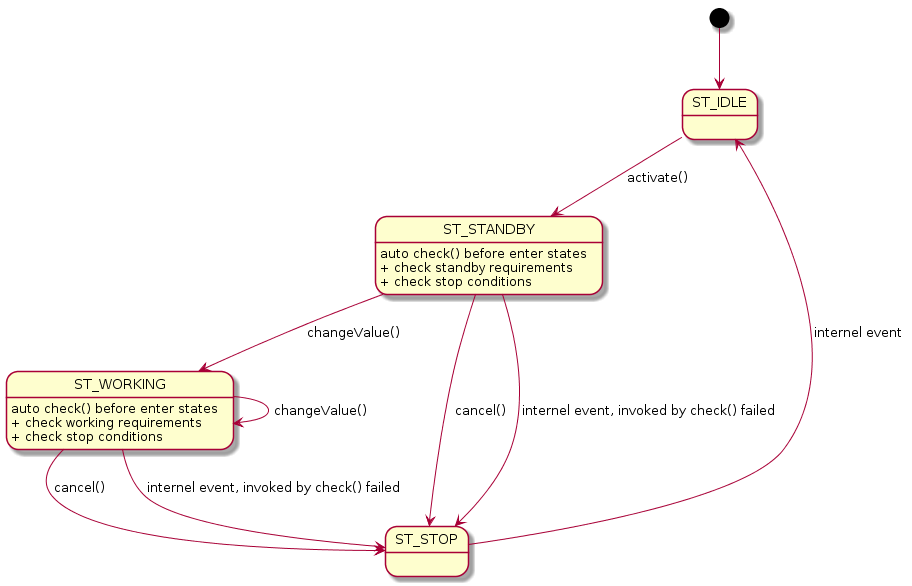

# CAN talker State Machine

* states list = {ST_IDLE, ST_STANDBY, ST_WORKING, ST_STOP}
* user actions list = {activate(), changeValue(), cancel()}

```puml
@startuml
[*] --> ST_IDLE
ST_IDLE --> ST_STANDBY : activate()
ST_STANDBY --> ST_WORKING : changeValue()
ST_STANDBY --> ST_STOP : cancel()
ST_STANDBY : auto check() before enter states
ST_STANDBY : + check standby requirements
ST_STANDBY : + check stop conditions
ST_STANDBY --> ST_STOP : internel event, invoked by check() failed
ST_WORKING --> ST_WORKING : changeValue()
ST_WORKING --> ST_STOP : cancel()
ST_WORKING : auto check() before enter states
ST_WORKING : + check working requirements
ST_WORKING : + check stop conditions
ST_WORKING --> ST_STOP : internel event, invoked by check() failed
ST_STOP --> ST_IDLE : internel event
@enduml
```

