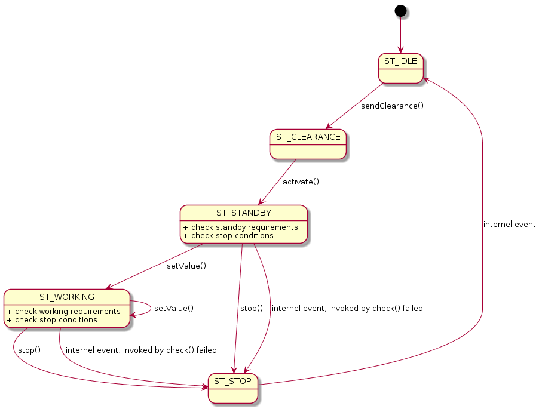

# Robust communication between ROS node and CAN bus
* when we communicate between ROS node and CAN bus, we need to handle a lot of exceptions from CAN bus and safety backup between ROS node.
* Here I propose a state machine to maintain CAN bus exceptions
* and a heartbeat mechanism between ROS nodes (not i this repo yet)

# State Machine to handle exceptions
* there is a online internal requirement_check() in each state
* if a state failed to requirement_check(), this control unit will automatically shutdown, restart, and notify other units.
* The advantage of state machine is easy scaled up for exceptions, and can do internal auto-check easily.
* states list = {ST_IDLE, ST_CLEARANCE, ST_STANDBY, ST_WORKING, ST_STOP}
* user actions list = {activate(), changeValue(), cancel()}

